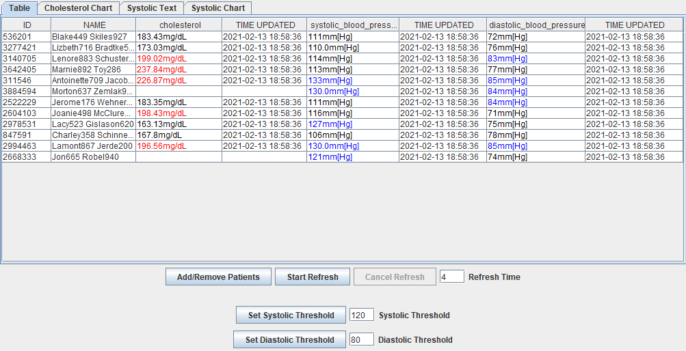

# FIT3077 Assignment - FHIR Health Monitor

Created by [Malavan Srikumar](https://github.com/maladeveloper) and [Adam Zuchowicz](https://github.com/adamzuch).

## Description
This repository contains the source code for a FHIR Health Monitor application created for assignment 2 and 3 of FIT3077 - Software engineering: Architecture and design.

The main purpose of this assignment was to create a maintainable and extensible system using object oriented design patterns and principles.

Bonus marks were awarded for using machine learning to predict what causes a high level of cholesterol in a patient. The relevant files for this task are in `machine_learning_task/`.

### Results

* Assignment 2: **113.33%** (bonus marks awarded)
* Assignment 3: **92.86%**

## Requirements
This project came in two stages - assignment 2 and assignment 3. The features of the application at each stage are outlined below.

### Assignment 2
* Practitioners can access a list of their patients by logging in with their id.
* Practitioners can select one or more patients to monitor their current total cholesterol value [mg/dL] in a conveniant table view.
* Practitioners can set the frequency (N seconds) with which the monitor refreshes the total cholesterol value.
* Practitioners can easily add or remove patients from the monitor view without restarting the application.
* Patients whose total cholesterol value is above the average of monitored patients is highlighted in red.
* Practitioners can click on a patient to reveal more information about them such as date of birth, gender and address (including city, state, country).

### Assignment 3
Contains all the features from assignment 2 as well as additional ones outlined below:

* The monitor table view can display any combination of the following patient health information: total cholesterol [mg/dL] (from assignment 2), systolic blood pressure [mmHg] and diastolic blood pressure [mmHg].
* Practitioners can easily change the health information displayed on the monitor without restarting.
* A practitioner can view all of their patient's current total cholesterol in a conveniant graphical monitor.
* Practitioners can set a threshold for high systolic and diastolic blood pressure. Any patient with blood pressure over the threshold is highlighted in blue.
* Practitioners can choose to view the previous five systolic blood pressure readings for patients which have a current value over the threshold. These values can be presented in a textual or graphical monitor.

## Architecture and design
Refer to `docs/` for UML class diagrams and their associated design rationale.

`class-diagram-a2.pdf` is the initial system design for assignment 2.

`class-diagram-a3.pdf` is an evolution of the original design which accomodates additional requirements for assignment 3.

## Technologies used
* Java
* Java Swing
* Gradle
* Python 3
* Flask
* Microsoft Azure

## See also
[maladeveloper/flask-backend](https://github.com/maladeveloper/flask-backend/) which contains the source code for the flask server.

 